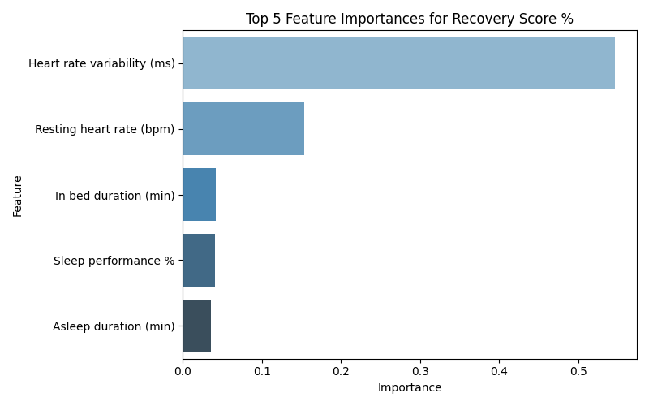

## Whoop Recovery Prediction

This tool predicts a user's WHOOP recovery score using biometric data such as heart rate, respiratory rate, and sleep metrics. It is based on an XGBoost model trained on real data and serves as a demonstration of how biometric signals can be used to infer recovery readiness.

## Live Demo

You can interact with the model via the [Hugging Face Space](https://huggingface.co/spaces/elliotrosen/whoop-recovery) by adjusting sliders for key input features and instantly seeing the predicted score.

## Project Overview

Two models were trained and evaluated for predicting WHOOP recovery scores:

- A **neural network** built with FastAI, using tabular data preprocessing and custom architecture.
- An **XGBoost regression model**, trained with K-Fold cross-validation and early stopping, which ultimately showed stronger performance.

📌 **The deployed model in this app is the XGBoost version**, based on its higher accuracy and consistency across folds and the test set.

The final deployment was built with **Gradio and Python**, allowing for an interactive interface hosted via Hugging Face Spaces.

Both model training notebooks (`nn_model.ipynb` and `xgboost_model.ipynb`) are included in the repo for transparency and reproducibility. They include data preprocessing, feature engineering, and model evaluation.

## Neural Net Model

For this project, I also created a Neural Network (NN) model that predicts the WHOOP recovery score using biometric data. Here’s an overview of how the model is built:

### 1. Preprocessing
- Data is cleaned by removing missing values and certain unnecessary columns.
- Specific columns related to sleep stages (Deep, REM, and Light sleep) are used to calculate sleep ratios.
- Numerical features are imputed with the median value to handle missing data.
- Irrelevant columns such as Cycle start time, Cycle end time, and other non-informative fields are dropped.

### 2. Target Variable
- The target variable is the **recovery score** (a percentage), predicted based on the cleaned features.

### 3. Tabular Data Setup
- The dataset is split into training and validation sets using `RandomSplitter`.
- `TabularPandas` from `fastai` is used to handle both categorical and continuous variables.
- Data transformations such as categorifying, filling missing values, and normalizing are applied to prepare the dataset for training.

### 4. Model Architecture
- A neural network model is built using `fastai`’s `tabular_learner`. The model architecture consists of two fully connected layers with 10 nodes each.
- The `EarlyStoppingCallback` is used to prevent overfitting by stopping training when the validation loss stops improving.

### 5. Training
- A learning rate finder is used to determine an optimal learning rate for training.
- The model is trained for a maximum of 35 epochs with a learning rate of **0.02** using the `fit_one_cycle` method.

### 6. Evaluation
- After training, the model’s performance is evaluated on the test set using various metrics:
  - **RMSE** (Root Mean Squared Error)
  - **MAE** (Mean Absolute Error)
  - **R²** (Coefficient of Determination)
- The trained neural network model is saved as a `.pkl` file for future use.

### 7. Test Set Results
- The neural network model achieved strong test set performance, with **RMSE**, **MAE**, and **R²** metrics indicating high accuracy.
#### Test Set Performance
- **RMSE**: 7.6714
- **MAE**: 6.3678
- **R²**: 0.8787

To improve performance and reduce variance, an ensemble of **five neural networks** was trained with different random seeds. Each learner was independently initialized and trained on the same dataset using FastAI's `tabular_learner` with early stopping. Final predictions were generated by averaging the outputs across all five models. This ensemble approach led to noticeable improvements over a **single model**, achieving an **RMSE of 6.81** and **R² of 0.90** on the test set, compared to **7.67 RMSE** and **0.88 R²** for a single learner.

#### Ensemble Test Results
- **RMSE**: 6.8128
- **MAE**: 5.7977
- **R²**: 0.9043

The neural network model, like the XGBoost model, can predict the WHOOP recovery score, but it uses a different architecture, offering a good comparison of model performance.

## XGBoost Model

The model I ultimately deployed to predict recovery scores was an **XGBoost** model. The dataset was preprocessed in the same way as the NN. The model is trained with a **5-fold cross-validation** approach with early stopping to avoid overfitting.

### Model Details
- **Model Type**: XGBoost Regressor
- **Hyperparameters**:
  - Learning rate: 0.025  
  - Max depth: 4  
  - Subsample: 0.9  
  - Colsample by tree: 0.9  
  - Early stopping rounds: 25  

### Performance Metrics (5-Fold Cross Validation)
- **Avg R²**: 0.9046 ± 0.0175  
- **Avg RMSE**: 7.02 ± 0.53  

### Test Set Performance
- **Test RMSE**: 6.6193  
- **Test MAE**: 5.3738  
- **Test R²**: 0.9097  

The XGBoost model performed well on the test data with an **R² score of 0.9097**, indicating that the model explains **90.97%** of the variance in the recovery score. The **RMSE** (Root Mean Squared Error) is **6.6193**, which means the model’s predictions are generally close to the actual values.

### Feature Importance

A feature importance plot is included below, which highlights which features contribute the most to the predictions. HRV clearly emerges as a dominant predictor among the features, which aligns with my own experience as a WHOOP user - I've consistently noticed a strong connection between my HRV and daily recovery scores.

**Feature Importance Plot:**  


## Local Setup

Clone the repo and run:

```bash
pip install -r requirements.txt
python app.py